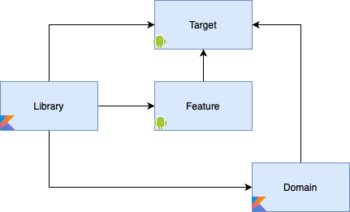

# Module Structure

There are 4 types of modules:

- library - small reusable peace of code, that does not contain any app specific or core domain
  logic
- domain - domain module of application, we do not separate data/domain/e.t.c. layers KISS
- feature - small self-contained screen or set of app screens
- target - application root module
- plugin - gradle build plugin

Modules could depend on each other in following combinations
- target <- (library, domain, feature)
- feature <- (library, domain)
- domain <- (library, domain)
- library <- (library)
- plugin <- ()

Note, no feature could depend on another feature, and no domain module could depend on feature.
